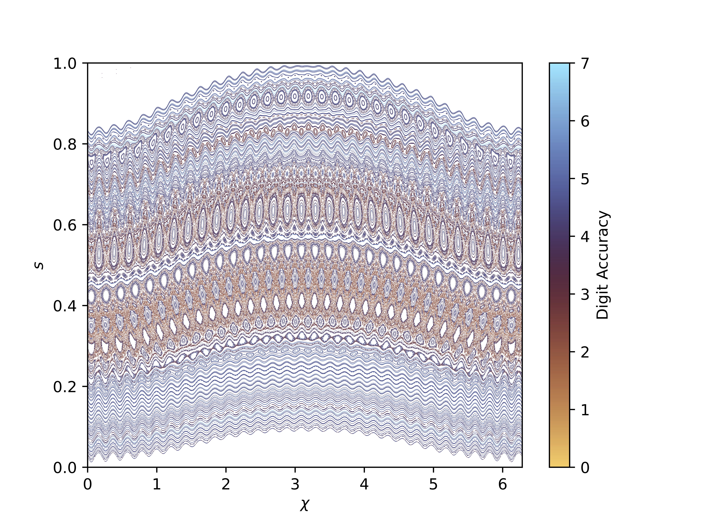

# Summary

The dynamics of energetic particle (EP) species, born from fusion reactions or plasma heating schemes, are critical for predicting the behavior of magnetic confinement fusion experiments and future fusion reactors. Because energetic particles are largely collisionless, the orbits of Monte Carlo samples drawn from a given distribution function can be efficiently integrated in prescribed electromagnetic fields. In addition to the static magneto-hydrodynamic (MHD) equilibrium fields produced by the electromagnetic coils of a fusion device, MHD waves can be excited by—and resonantly transport—energetic particle populations.

FIRM3D is an open-source Python/C++/CUDA software suite for modeling energetic particle dynamics in 3D magnetic fields, available at [https://github.com/ejpaul/firm3d](https://github.com/ejpaul/firm3d). The core guiding-center integration routines grew out of SIMSOPT [@2021Landreman], but have been extended to include additional physics and diagnostics not typically required in the stellarator optimization context. This standalone framework enables focused development of energetic particle physics capabilities with minimal dependencies, making it accessible to the broader stellarator and plasma physics community.

Components of FIRM3D include:

- Interfaces with MHD equilibrium and wave stability software (BOOZ\_XFORM, AE3D, FAR3D).
- CPU and GPU parallelized integration of the guiding center orbit equation, with symplectic and Runge-Kutta integrator options.
- Orbit visualization and transport diagnostics, including Poincaré maps, orbit classification, and weighted Birkhoff averaging.

# Statement of need

Recent advances in stellarator optimization [@2022LandremanOpt] have produced equilibria that satisfy many physics and engineering constraints for a fusion reactor. One critical feature is the ability to confine guiding center trajectories of energetic particle species. Through quasisymmetry—a hidden symmetry of the field strength that provides integrability of guiding center motion—stellarator magnetic fields can now be designed with excellent energetic particle confinement.

However, perturbing electromagnetic fields can still transport energetic particles. The class of MHD waves of primary concern are Alfvén eigenmodes (AEs), which are driven unstable by free energy in the EP distribution function and can resonantly transport EPs. Alfvénic activity is considered the major limitation to alpha confinement in burning tokamak plasmas [@2014Gorelenkov], and has been observed in numerous stellarator experiments [@2011Toi; @2020Rahbarnia]. Given the recent growth of the private fusion industry, companies pursuing the stellarator path to fusion require tools for assessing EP-driven wave stability and the resulting EP transport.

FIRM3D addresses this need by providing a modular, GPU-accelerated energetic particle simulation framework that bridges MHD equilibrium solvers and wave stability codes. It is intended for plasma physicists and fusion engineers who require EP simulation capabilities beyond those available in optimization-focused codes. The FIRM3D routines and their SIMSOPT precursors have already been used in published research: a survey of EP loss mechanisms [@2022Paul], AE-induced transport analysis [@2023Paul; @knyazev2026shear], trapped EP resonances theory [@2025Chambliss], and analysis of the Helios alpha confinement [@von2026alpha;@swanson2025overview].

Existing tools such as ASCOT5 [@varje2019ascot5] provide high-fidelity Monte Carlo EP tracking, primarily for tokamak geometry. FIRM3D complements these by offering tight integration with the stellarator optimization ecosystem (SIMSOPT, BOOZ\_XFORM), symplectic and Runge-Kutta integrator options, and native GPU acceleration via CUDA, in a lightweight open-source Python package.

# Structure and capabilities

Integration of guiding center trajectories is performed given the magnetic field, particle initial conditions, and integrator specification. The equilibrium magnetic field is typically provided through an interface with BOOZ\_XFORM [@booz_xform] via the `BoozerMagneticField` class. Since BOOZ\_XFORM computes the Fourier harmonics of the magnetic field on a uniform radial grid, Lagrange interpolation is used to evaluate the field throughout the volume. The magnetic field perturbation corresponding to an MHD mode from AE3D [@2010Spong] or FAR3D [@2024Varela] can then be superimposed on the interpolated equilibrium field; such modes are stored on a radial grid of Fourier harmonics in Boozer coordinates. Helper functions are provided to generate particle initial conditions from a known distribution function or by preserving a conserved quantity such as energy or canonical momentum.

Three integrators are available. An interface to the Boost Runge-Kutta Dormand-Prince 5 method [@BoostOdeint] provides adaptive step size control and dense output. A custom Dormand-Prince 5 implementation adds minimum step size control based on [@2007Press] to prevent excessively small steps. A symplectic integrator for non-canonical guiding-center orbits uses the explicit-implicit Euler scheme of [@2020Albert].

Since the performance bottlenecks are field interpolation and trajectory integration, the Lagrange interpolating polynomials and integrators are implemented in C++, with Python interfaces via pybind11 [@pybind11]. MPI parallelization over Fourier harmonics and OpenMP parallelization over interpolant nodes accelerate field setup. Because guiding center trajectories are independent, Monte Carlo samples are trivially parallelized over CPUs or GPUs; CUDA kernels implement field interpolation and trajectory integration on GPU.

Given trajectory data, transport diagnostics include Poincaré plots, characteristic orbit frequencies, weighted Birkhoff averaging [@duignan2023distinguishing], and orbit classification [@2022Paul; @2023Albert]. Examples of these capabilities are highlighted below.

Installation instructions and API documentation are available at [https://firm3d.readthedocs.io/](https://firm3d.readthedocs.io/). Examples are available in the repository at [https://github.com/ColumbiaStellaratorTheory/firm3d](https://github.com/ColumbiaStellaratorTheory/firm3d). FIRM3D is released under the MIT License. A suite of unit and regression tests is run automatically on CPUs and GPUs via continuous integration on GitHub Actions.

# Conservation properties

![Left: Energy as a function of time for an alpha particle in the $\beta = 2.5\%$ Landreman QH configuration. The Dormand-Prince algorithm exhibits a net energy drift over time, while the symplectic algorithm exhibits a stable moving time average of the energy (over $10^{-4}$ seconds). Right: Relative error in canonical momentum $P_{\eta}$ conservation for a perfectly quasisymmetric field. 10 particles are traced in the same configuration for $10^{-4}$ seconds, and the maximum error over the trajectory for each particle is computed. The maximum error over the 10 particles is reported. The non-quasisymmetric field-strength harmonics are artificially removed so that momentum conservation is expected. \label{fig:momentum_error}](figures/conservation.png)

FIRM3D is verified against known conservation laws. For time-independent fields, the guiding-center Lagrangian conserves total energy $E$. Runge-Kutta methods suffer from net energy drift over time, while the symplectic integrator exhibits long-time stability with a conserved time-averaged energy, as shown in \autoref{fig:momentum_error}. For a perfectly quasisymmetric field, the toroidal canonical momentum $P_{\eta}$ is also conserved [@1995Boozer]. \autoref{fig:momentum_error} shows the relative error in $P_{\eta}$ as a function of the number of Lagrange interpolation nodes and the Dormand-Prince tolerance. At a tolerance of $10^{-9}$ and 64 interpolation nodes, the relative error converges to approximately $10^{-8}$.

# Cross-code comparison

\autoref{fig:simple_orbit} shows a benchmark against SIMPLE [@2020Albert], which integrates the guiding center equations using a symplectic method. We first compare a trapped 3.5 MeV alpha particle trajectory in the precise QH equilibrium [@2022LandremanPrecise]; the comparison uses a relatively integrable trajectory since phase-space chaos generally precludes point-wise agreement between integrators. FIRM3D used the Dormand-Prince algorithm with relative tolerance $10^{-10}$ and 96 Lagrange nodes; SIMPLE used the symplectic Euler method with 4096 timesteps per toroidal transit. The relative error in the $s$ coordinate at $10^{-3}$ seconds is $7.8\times 10^{-3}$. We next compare loss fractions for 5000 3.5 MeV alpha particles sampled from a fusion birth distribution in the precise QA equilibrium [@2022LandremanPrecise] traced for $10^{-2}$ seconds; the two codes report identical loss fractions.

# Scaling on GPUs and CPUs

{height="5cm"}

\autoref{fig:cpu_scaling} shows wall-clock scaling on the NERSC Perlmutter cluster. Particles are sampled from a fusion birth distribution in the Wistell-A equilibrium and integrated for $10^{-2}$ seconds. For fewer than $10^3$ samples the CPU calculation is more efficient due to GPU launch latency; above $10^3$ samples the GPU calculation is approximately an order of magnitude faster. Details of the GPU implementation are described in [@2026Czekanski].

# Example applications

{width="60%"}

FIRM3D's orbit classification, transport diagnostics, and AE-induced transport capabilities are illustrated in \autoref{fig:classification} and \autoref{fig:wba}. For the former, $5\times 10^{5}$ alpha particles are sampled from a fusion birth distribution in the $\beta = 2.5\%$ QA configuration [@2022LandremanPrecise] and traced for $10^{-2}$ seconds (0.62% lost). Trapping class (banana, ripple, barely trapped) is identified along each trajectory; of the lost particles, 29% are banana-class, 0.12% ripple-trapped, 0.03% barely trapped, and 4.8% transition between classes, with 66% exiting promptly before classification is possible. The normalized variation $\sqrt{\langle \Delta J_{\|}^2 \rangle}/\langle J_{\|} \rangle$ of the parallel adiabatic invariant $J_{\|} = \oint dl\, v_{\|}$ measures integrability [@2023Albert], and $\gamma_c$ measures convective transport [@2022Paul]; most lost banana particles exceed the 1% non-integrability threshold while $\gamma_c < 0.2$, indicating orbital chaos drives the losses. For \autoref{fig:wba}, passing particles with $\mu/E = 0.1$ are traced in the $\beta = 2.5\%$ QA equilibrium [@2022LandremanOpt] with a single-harmonic AE ($m = 30$, $n = 14$, $\omega = 136$ kHz; Table 1 of [@2023Paul]). The weighted Birkhoff average of $P_{\zeta}$ [@duignan2023distinguishing] serves as an integrability diagnostic, with digit accuracy below 3 indicating chaotic motion [@knyazev2026shear].

# Acknowledgements

We acknowledge the SIMSOPT development team for providing the foundational guiding center integration routines. We acknowledge funding through the U.S. Department of Energy under contracts DE-SC0024630, DE-SC0024548, and DE-AC02-09CH11466, and through the Simons Foundation collaboration 'Hidden Symmetries and Fusion Energy,' Grant No. 601958. This research used resources of the National Energy Research Scientific Computing Center (NERSC), a DOE Office of Science User Facility, under NERSC award ERCAP0031926.

# References
