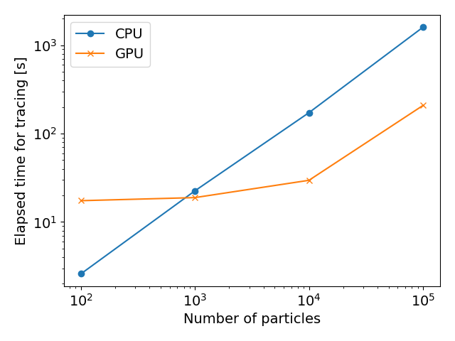
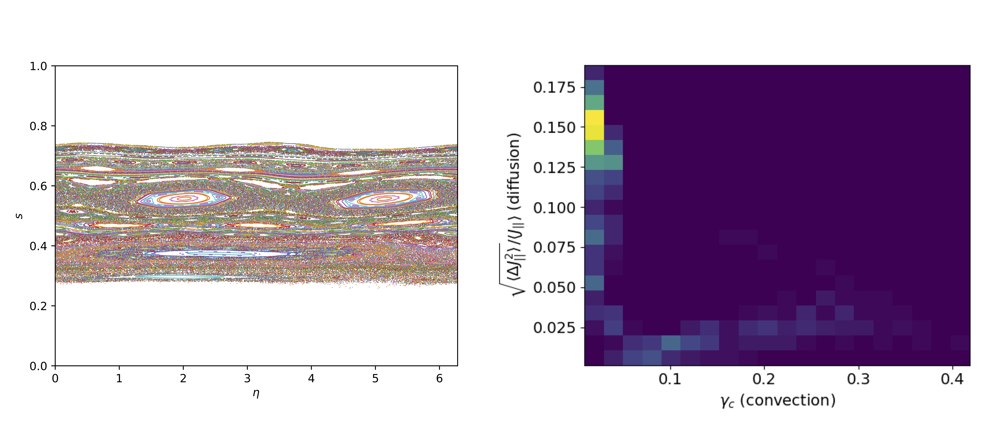

<!-- 
# Submission notes
- 250-1000 words
- A summary describing the high-level functionality and purpose of the software for a diverse, non-specialist audience.
- A Statement of need section that clearly illustrates the research purpose of the software and places it in the context of related work.
- A list of key references, including to other software addressing related needs. Note that the references should include full names of venues, e.g., journals and conferences, not abbreviations only understood in the context of a specific discipline.
- Mention (if applicable) a representative set of past or ongoing research projects using the software and recent scholarly publications enabled by it.
- Acknowledgement of any financial support.
- Sections from simsopt paper: summary, statement of need, capabilities, acknowledgements, references -->

# Summary

The dynamics of energetic particle species, born from fusion reactions or plasma heating schemes, are critical for predicting the behavior of magnetic confinement fusion experiments and future fusion reactors. Given that energetic particles are largely collisionless, the orbits of Monte-Carlo samples drawn from a given distribution function can be efficiently integrated in given electromagnetic fields. In addition to the static magneto-hydrodynamic (MHD) equilibrium magnetic fields produced due to the electromagetic coils in a fusion device, MHD waves are excited by and can transport energetic particle populations. 

FIRM3D is a software suite for modeling of energetic particle dynamics in 3D magnetic fields. The core routines are based on SIMSOPT [@2021Landreman], but have been extended to include additional physics and diagnostics that are not typically required in the optimization context. This standalone framework enables more modular development of FIRM3D with minimal dependencies. 
 
Components of FIRM3D include:

- Interfaces with MHD equilibrium and wave stability software.
- CPU and GPU parallelized integration of the guiding center orbit equation.
- Orbit visualization and transport diagnostics, including Poincaré maps and weighted Birkhoff averaging.

<!-- The forces on stars, galaxies, and dark matter under external gravitational
fields lead to the dynamical evolution of structures in the universe. The orbits
of these bodies are therefore key to understanding the formation, history, and
future state of galaxies. The field of "galactic dynamics," which aims to model
the gravitating components of galaxies to study their structure and evolution,
is now well-established, commonly taught, and frequently used in astronomy.
Aside from toy problems and demonstrations, the majority of problems require
efficient numerical tools, many of which require the same base code (e.g., for
performing numerical orbit integration). -->

# Statement of need

Given recent advances by the stellarator optimization community [@2022LandremanOpt], stellarator equilibria have now been identified which satisfy many physics and engineering constraints for a fusion reactor. One of the critical features of a stellarator equilibrium is the ability to confine the guiding center trajectories of energetic particle species. Through concepts such as quasisymmetry, the presence of a hidden symmetry of the field strength which provides integrability of guiding center motion, the magnetic fields of stellarators can now be designed to have excellent energetic particle confinement.

However, there are likely to be perturbing electromagnetic fields that can transport energetic particles, such as magneto-hydrodynamic (MHD) waves. The class of MHD waves of primary concern for interaction with EP species are Alfvén eigenmodes (AEs). AEs are driven unstable by free energy in the EP distribution function, and they can resonantly transport EPs. Alfvénic activity is considered the major limitation to alpha confinement in a burning tokamak plasma [@2014Gorelenkov]. The interaction of Alfvén eigenmodes (AEs) with energetic particles has been shown to drive substantial flattening of the fast-ion profile in tokamak experiments [@2008Heidbrink]. Alfvénic activity has also been observed on several stellarator configurations, including HSX [@2009Deng], CHS [@2002Takechi], LHD [@2011Toi], W7-AS [@1994Weller], TJ-II [@2014Melnikov], W7-X [@2020Rahbarnia], and Heliotron-J [@2007Yamamoto]. Given the recent growth of the private fusion industry, several start-up companies pursuing the stellarator path to fusion are interested in assessing the stability of EP-driven waves and their impact on EP transport. The development of FIRM3D is, therefore, timely. 

FIRM3D grew out of the guiding center integration routines in SIMSOPT, but has been extended to include additional physics and diagnostics specifically needed for energetic particle studies. The standalone framework enables more focused development of energetic particle physics capabilities with minimal dependencies, making it accessible to the broader stellarator and plasma physics community. The FIRM3D routines and their SIMSOPT precursors have been used in published research, such as a survey of EP loss mechanisms [@2022Paul], transport driven by AEs [@2023Paul], and trapped EP resonances [@2025Chambliss]. 

# Structure and capabilities 

Integration of the guiding center trajectories is performed given the magnetic field, particle initial conditions, and integrator specification. The equilibrium magnetic field is typically generated through an interface with BOOZ_XFORM [@booz_xform] through the BoozerMagneticField class. Since BOOZ_XFORM computes the Fourier harmonics of the magnetic field on a uniform grid in the radial direction, interpolation is used to determine the magnetic field throughout the volume. The magnetic field corresponding to an MHD mode from AE3D [@2010Spong] or FAR3D [@2024Varela] can then be superimposed on the interpolated equilibrium field. Such MHD modes are saved on a radial grid containing the Fourier harmonics in Boozer coordinates. Several helper functions are provided to generate particle initial conditions from a known distribution function, or by preserving some known conserved quantity such as the energy or canonical momentum. Several integrators can be selected. An interface to the BOOST Runge-Kutta Dormand-Prince 5 method [@BoostOdeint] is provided, with adaptive step size control and dense output capabilities. To prevent the adaptive step size from becoming too small, a custom Dormand-Prince 5 method has also been implemented with minimum step size control based on [@2007Press]. Finally, a symplectic integrator for non-canonical guiding-center orbits is implemented using the explicit-implicit Euler scheme of [@2020Albert]. 

Since the performance bottlenecks for FIRM3D are field interpolation and trajectory integration, the Lagrange interpolating polynomials and trajectory integrators are implemented in C++. Interfaces with python are provided through pybind11 [@pybind11]. MPI parallelization over Fourier harmonics and OpenMP parallelization over the number of interpolant nodes are provided to accelerate the field interpolant setup. Given the independence of guiding center trajectories, Monte-Carlo samples can be trivially parallelized over CPUs or GPUs. For GPU parallelization, CUDA kernels are implemented for field interpolation and trajectory integration. 

Given the trajectory data, several transport diagnostics can be computed, such as Poincaré plots, characteristic orbit frequencies, weighted Birkhoff averaging [@2021Duignan], and orbit classification [@2022Paul]. Examples of some of these capabilities will be highlighted below. 

# Conservation properties

![Left: Energy as a function of time for an alpha particle in the $\beta = 2.5\%$ Landreman QH configuration. The Dormand-Prince algorithm exhibits a net energy drift over time, while the symplectic algorithm exhibits a stable moving time average of the energy (over $10^{-4}$ seconds). Right: Relative error in canonical momentum $P_{\eta}$ conservation for a perfectly quasisymmetric field. 10 particles are traced in the same configuration for $10^{-4}$ seconds, and the maximum error over the trajectory for each particle is computed. The maximum error over the 10 particles is reported. The non-quasisymmetric field-strength harmonics are artifically removed so that momentum conservation is expected. \label{fig:momentum_error}](conservation/conservation.png)

Given a time-independent system, such as the guiding center Lagrangian in time-independent fields, the total energy $E$ should be conserved. For a sympletic timestepper, while $E$ is not precisely conserved throughout the trajectory, it demonstrates long-time stability, with a time-averaged value (over, e.g. several bounce periods) remaining conserved. On the other hand, Runge-Kutta methods suffer from net energy drift over time. This behavior is observed in \autoref{fig:momentum_error}.

The accuracy of the integration methods depend on several resolution parameters, including the fixed timestep size and root solve tolerance for the symplectic method and the integration tolerance parameter for the Dormand-Prince method. Given the Lagrange field interpolation method, field smoothness will also impact the accuracy of integration. Thus improved conservation properties are observed at higher interpolant resolution. Given a perfectly quasisymmetric magnetic field, the toroidal canonical momentum $P_{\eta}$ is also conserved [@1995Boozer]. In \autoref{fig:momentum_error} we show the relative error in momentum conservation as a function of the interpolant resoluation parameter (the number of Lagrange interpolation nodes) and the tolerance parameter provided to the Dormand-Prince integrator. For an integration tolernace of $10^{-9}$ and grid resolution of 64, the relative error converges to around $10^{-8}$. 

# Cross-code comparison

We perform a benchmark, \autoref{fig:simple_orbit}, with the SIMPLE code [@2020Albert], which integrates the guiding center equations without MHD activity using a symplectic method. We first compare the trajectory of a trapped 3.5 MeV alpha particle in the precise QH equilibrium [@2022LandremanPrecise]. Given phase-space chaos, we don't generally expect good agreement between integrators for all trajectories, so the comparison is performed for a relatively integrable trajectory. With FIRM3D, the Dormand-Prince algorithm was used with a relative tolerance of $10^{-10}$ and 96 Lagrange interpolation nodes. With SIMPLE, the symplectic Euler method is used with 4096 timesteps per toroidal transit. The relative error in the $s$ coordinate at $10^{-3}$ seconds is $7.8\times 10^{-3}$. We next compare the loss fraction for a fusion birth distribution to demonstrate statistical agreement. 5000 3.5 MeV alpha particles are sampled from a fusion birth distribution function and traced in the precise QA equilibrium [@2022LandremanPrecise] for $10^{-2}$ seconds. The two codes report identical loss fractions at the end of the simulation. FIRM3D was run with 48 Lagrange interpolation nodes and a relative tolerance of $10^{-8}$, and SIMPLE was run with 256 timesteps per toroidal transit. 

# Scaling on GPUs and CPUs

In \autoref{fig:cpu_scaling} we show the scaling of wall clock time with CPU and GPU resources on the NERSC Perlmutter cluster. Particles are sampled from a fusion birth distribution in the Wistell-A equilibrium and integrated for $10^{-2}$ seconds. For a small number of Monte-Carlo samples, the CPU calculation is more efficient due to higher latency in the GPU calculation. However, for more than $10^3$ samples, the GPU calculation is about an order of magnitude more efficient. 

{height="5cm"}

# Example applications

Given trajectory integration data, the transport characteristics can be identified. 
$5\times 10^{5}$ particles are sampled from a fusion birth distribution function and traced in the $\beta = 2.5%$ QA configuration [@2022LandremanPrecise]. 0.62% of samples are lost to the boundary in $10^{-2}$ seconds. The trapping class (banana, ripple, and barely trapped) can then be distinguished at any point in time along the trajectory. Of these losses, 0.12% are trapped in local ripple wells, 0.03% are barely trapped, 29% are in the banana class, and 4.8% transition between trapping classes. 66% of the lost samples exit the boundary promptly such that their trapping class cannot be identified. Given that banana-trapped particles represent the majority of losses with sufficient data to categorize, metrics of the diffusive and convective characteristics of the motion are shown in \autoref{fig:classification}. The parallel adiabatic invariant, $J_{\|} = \oint dl \, v_{\|}$, is an approximately conserved quantity for guiding center trajectories that lie on drift surfaces. The normalized variation in the parallel adiabatic invariant, $\sqrt{\langle \Delta J_{\|}^2 \rangle}/\langle J_{\|} \rangle$, is evaluated as a measure of integrability. A value of normalized variation of 1\% is typically used as a cutoff for non-integrable orbits [@2023Albert]. The normalized variation of $J_{\|}$ is greater than 1\% for most of the lost particles while $\gamma_c$, a measure of convective transport, is relatively small ($< 0.2$ [@2022Paul]) over the population of lost particles. This data indicates that orbital chaos is responsible for the losses. The left panel of \autoref{fig:classification} shows a Poincaré map revealing the chaotic layers responsible for banana-drift diffusion. 

<!--  - WBA + tracing for Alexa example --->

# Acknowledgements

We acknowledge the SIMSOPT development team for providing the foundational guiding center integration routines. We acknowledge funding through the U.S. Department of Energy, under contracts DE-SC0024630, DE-SC0024548 and DE-AC02-09CH11466. We also acknowledge funding through the Simons Foundation collaboration ‘Hidden Symmetries and Fusion Energy,’ Grant No. 601958. This research used resources of the National Energy Research Scientific Computing Center (NERSC), a Department of Energy Office of Science User Facility using NERSC award ERCAP0031926.

# References